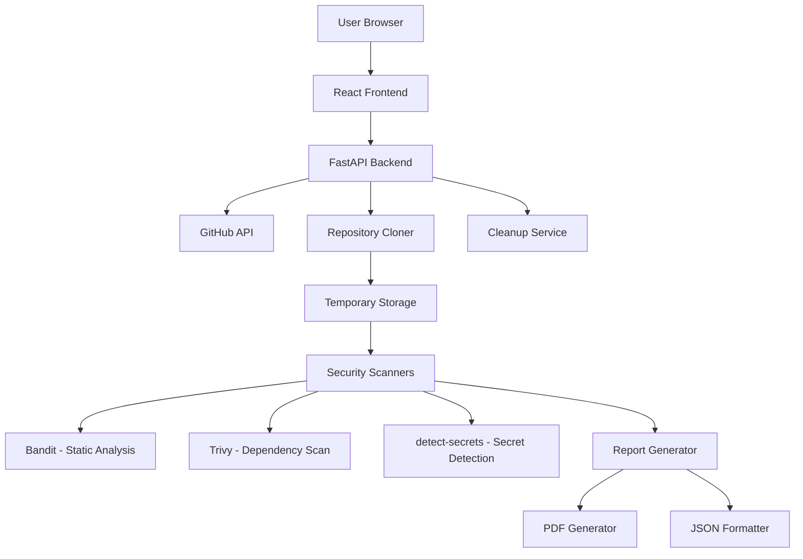

# Design Document

## Overview

CodeShield is a web-based security scanning platform that analyzes public GitHub repositories for vulnerabilities, secrets, and dependency issues. The system follows a client-server architecture with a React frontend and FastAPI backend, utilizing industry-standard security scanning tools (Bandit, Trivy, detect-secrets) to provide comprehensive analysis within 2-3 minutes.

The design prioritizes simplicity, performance, and security while maintaining a stateless architecture that doesn't permanently store user code or scan history.

## Architecture

### High-Level Architecture



### System Flow

1. **Input Phase**: User submits GitHub repository URL via React frontend
2. **Validation Phase**: Backend validates URL and repository accessibility
3. **Clone Phase**: Repository is cloned to temporary directory with size limits
4. **Scan Phase**: Parallel execution of security scanning tools
5. **Aggregation Phase**: Results are collected, categorized, and formatted
6. **Report Phase**: Dashboard displays results with download options
7. **Cleanup Phase**: Temporary files are automatically removed

## Components and Interfaces

### Frontend Components (React + TypeScript)

#### 1. URL Input Component
- **Purpose**: Capture and validate GitHub repository URLs
- **Props**: `onSubmit: (url: string) => void`, `isLoading: boolean`
- **Validation**: URL format, GitHub domain, public repository check
- **State**: Input value, validation errors, submission status

#### 2. Scan Progress Component
- **Purpose**: Display real-time scanning progress and status
- **Props**: `scanStatus: ScanStatus`, `progress: number`
- **Features**: Progress bar, current operation display, estimated time remaining
- **States**: Cloning, Scanning (Bandit/Trivy/Secrets), Generating Report

#### 3. Results Dashboard Component
- **Purpose**: Display comprehensive security scan results
- **Props**: `scanResults: ScanResults`
- **Sub-components**:
  - Summary Cards (total issues, severity breakdown)
  - Vulnerability Table (sortable, filterable)
  - Charts (severity distribution, issue types)
  - Tab Navigation (Static/Dependencies/Secrets)

#### 4. Report Download Component
- **Purpose**: Handle report generation and download
- **Props**: `scanResults: ScanResults`, `repoUrl: string`
- **Features**: PDF/JSON download buttons, generation status, error handling

### Backend Components (FastAPI + Python)

#### 1. Repository Service
```python
class RepositoryService:
    async def validate_repository(self, url: str) -> bool
    async def clone_repository(self, url: str) -> str  # Returns temp path
    async def get_repository_size(self, url: str) -> int
    async def cleanup_repository(self, path: str) -> None
```

#### 2. Scanner Service
```python
class ScannerService:
    async def run_bandit_scan(self, repo_path: str) -> BanditResults
    async def run_trivy_scan(self, repo_path: str) -> TrivyResults
    async def run_secret_scan(self, repo_path: str) -> SecretResults
    async def aggregate_results(self, *results) -> ScanResults
```

#### 3. Report Service
```python
class ReportService:
    def generate_json_report(self, results: ScanResults) -> dict
    async def generate_pdf_report(self, results: ScanResults) -> bytes
    def format_vulnerability_data(self, results: ScanResults) -> dict
```

### API Endpoints

#### POST /api/scan
- **Purpose**: Initiate repository scan
- **Request**: `{"repository_url": "https://github.com/user/repo"}`
- **Response**: `{"scan_id": "uuid", "status": "initiated"}`
- **Validation**: URL format, repository accessibility, size limits

#### GET /api/scan/{scan_id}/status
- **Purpose**: Get real-time scan progress
- **Response**: `{"status": "scanning", "progress": 45, "current_operation": "running_trivy"}`

#### GET /api/scan/{scan_id}/results
- **Purpose**: Retrieve complete scan results
- **Response**: Complete ScanResults object with all findings

#### GET /api/scan/{scan_id}/download/{format}
- **Purpose**: Download reports in PDF or JSON format
- **Parameters**: format = "pdf" | "json"
- **Response**: File download with appropriate headers

## Data Models

### Core Data Models

```typescript
interface ScanResults {
  scanId: string;
  repositoryUrl: string;
  scanDate: string;
  summary: {
    critical: number;
    high: number;
    medium: number;
    low: number;
    total: number;
  };
  staticAnalysis: Vulnerability[];
  dependencies: DependencyVulnerability[];
  secrets: SecretFinding[];
  scanDuration: number;
  status: 'completed' | 'failed' | 'partial';
}

interface Vulnerability {
  tool: 'bandit' | 'trivy' | 'detect-secrets';
  file: string;
  line?: number;
  severity: 'critical' | 'high' | 'medium' | 'low';
  title: string;
  description: string;
  recommendation: string;
  cveId?: string;
  confidence?: 'high' | 'medium' | 'low';
}

interface DependencyVulnerability extends Vulnerability {
  packageName: string;
  installedVersion: string;
  fixedVersion?: string;
  cveScore?: number;
}

interface SecretFinding extends Vulnerability {
  secretType: string;
  entropy?: number;
  isVerified?: boolean;
}
```

### Configuration Models

```python
class ScanConfig:
    MAX_REPO_SIZE_MB = 200
    SCAN_TIMEOUT_MINUTES = 5
    TEMP_DIR_PREFIX = "codeshield_"
    CLEANUP_DELAY_MINUTES = 10
    
class SecurityToolConfig:
    BANDIT_CONFIG = {
        "exclude_dirs": [".git", "node_modules", "__pycache__"],
        "severity_levels": ["low", "medium", "high"]
    }
    
    TRIVY_CONFIG = {
        "scan_types": ["vuln", "secret", "config"],
        "severity": ["UNKNOWN", "LOW", "MEDIUM", "HIGH", "CRITICAL"]
    }
```

## Error Handling

### Error Categories and Responses

#### 1. Input Validation Errors
- **Invalid URL Format**: Return 400 with specific format requirements
- **Private Repository**: Return 403 with explanation about public repo requirement
- **Repository Not Found**: Return 404 with suggestion to verify URL

#### 2. Processing Errors
- **Repository Too Large**: Return 413 with size limit information
- **Clone Timeout**: Return 408 with retry suggestion
- **Scanner Tool Failure**: Continue with other scanners, mark as partial results

#### 3. System Errors
- **Temporary Storage Full**: Return 503 with retry-after header
- **PDF Generation Failure**: Provide JSON fallback, log error
- **Network Issues**: Implement exponential backoff retry logic

### Error Response Format
```json
{
  "error": {
    "code": "REPO_TOO_LARGE",
    "message": "Repository size exceeds 200MB limit",
    "details": {
      "actual_size": "350MB",
      "max_allowed": "200MB"
    },
    "suggestions": ["Try scanning a smaller repository", "Contact support for enterprise options"]
  }
}
```

## Testing Strategy

### Unit Testing
- **Frontend**: Jest + React Testing Library for component testing
- **Backend**: pytest for service layer testing
- **Coverage Target**: 90% code coverage for critical paths

### Integration Testing
- **API Testing**: FastAPI TestClient for endpoint testing
- **Scanner Integration**: Mock repositories with known vulnerabilities
- **Report Generation**: Validate PDF/JSON output format and content

### End-to-End Testing
- **User Workflows**: Cypress for complete user journey testing
- **Performance Testing**: Load testing with various repository sizes
- **Error Scenarios**: Test all error conditions and recovery paths

### Security Testing
- **Input Validation**: Test malicious URLs and injection attempts
- **Resource Limits**: Verify size and timeout enforcement
- **Data Cleanup**: Ensure temporary files are properly removed

### Test Data Strategy
- **Sample Repositories**: Curated set of public repos with known issues
- **Vulnerability Database**: Test cases for each scanner tool
- **Performance Benchmarks**: Repositories of various sizes for timing tests

## Performance Considerations

### Optimization Strategies
- **Parallel Scanning**: Run Bandit, Trivy, and secret detection concurrently
- **Streaming Responses**: Use WebSocket or Server-Sent Events for progress updates
- **Resource Limits**: Enforce memory and CPU limits for scanner processes
- **Caching**: Cache repository metadata to avoid repeated GitHub API calls

### Scalability Design
- **Stateless Architecture**: No session storage, enables horizontal scaling
- **Queue System**: Future enhancement for handling multiple concurrent scans
- **Resource Cleanup**: Automated cleanup prevents storage accumulation
- **Rate Limiting**: Protect against abuse while maintaining usability